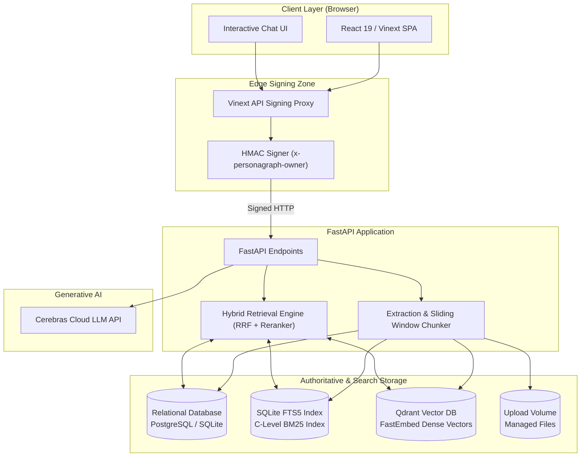

# System architecture

Personagraph is a document-grounded chat application. A React/Vinext frontend
proxies authenticated conversation requests to a FastAPI backend. The backend
owns document ingestion, authoritative relational data, hybrid retrieval, and
optional answer generation. Qdrant stores rebuildable vector indexes only.

## Runtime topology

*For interactive sequence diagrams of Document Ingestion and Hybrid Retrieval, see **[docs/system-diagram.md](system-diagram.md)**.*

Docker Compose is the production-shaped local topology. It runs the web, API,
and Qdrant services and mounts separate persistent volumes for authoritative
application data, uploaded files, and vector data. The frontend can also run as
a Cloudflare worker; its optional D1 schema is independent of the backend's
authoritative database.

## Component boundaries

| Component | Owns | Must not own |
| --- | --- | --- |
| Browser UI | Presentation state, user interaction, API client behavior | Trusted user identity or authoritative records |
| Frontend server routes | Same-origin API boundary, owner derivation, request signing | Document persistence or retrieval decisions |
| FastAPI application | Validation, ingestion, authorization checks, retrieval orchestration, response contracts | Browser sessions or vector-only source text |
| Relational store | Documents, chunks, people, index state, conversations, messages, citation snapshots, cleanup queue | Embedding vectors |
| Upload volume | Original managed document files | Database metadata |
| Qdrant | Embeddings and references needed for semantic candidate lookup | Authoritative chunk text or deletion state |
| Cerebras | Optional generation from selected evidence | Persistence or retrieval authority |

## Primary data flows

### Document ingestion

1. The API validates the upload type and size and writes the managed file.
2. Extraction produces pages, chunks, and detected people.
3. The relational transaction commits document metadata, chunks, people, and
   initial index state.
4. The vector service embeds chunks and upserts Qdrant records in batches.
5. Index state becomes `ready`; a vector failure instead records
   `needs_reindex` while the document remains available to lexical retrieval.

The relational commit precedes vector indexing so an optional or recoverable
vector failure cannot erase accepted application data.

### Grounded chat

1. The frontend signs the owner identity before forwarding chat/session calls.
2. The API scopes documents and sessions to that owner.
3. For existing sessions, recent conversational history is loaded to resolve pronouns,
   anaphora, and active topic entities via light query reformulation into standalone retrieval queries.
4. Lexical and semantic retrieval produce candidates; reciprocal-rank fusion
   combines their ranks and applies any explicit or resolved person boost.
5. Every vector hit is revalidated against scoped relational rows. Filenames,
   pages, excerpts, and citations are read from the authoritative store.
6. The pluggable LLM provider layer (Cerebras, OpenAI, Gemini, Anthropic,
   Ollama, Groq) receives conversational turns and generates an answer strictly
   grounded on retrieved evidence. Without an API key or when offline,
   deterministic local grounded synthesis preserves the exact same citation contract.
7. The conversational turn and citation snapshot are committed together.

### Deletion and recovery

1. A transaction queues the managed file path and deletes the document plus
   cascading relational metadata.
2. After commit, the backend retries file cleanup and removes matching vectors.
3. File or Qdrant outages do not reverse the committed deletion. Startup cleanup
   retries managed files, and vector reconciliation removes stale embeddings.

## Security and trust boundaries

- The browser is untrusted and cannot assert an owner ID directly.
- Frontend and backend must share a non-empty `AUTH_PROXY_SECRET` in production.
- Direct public access to FastAPI is not an authorization boundary; deploy it
  behind the signing frontend or an equivalent trusted proxy.
- Upload paths are managed by the backend. Cleanup refuses to unlink paths that
  resolve outside the configured upload directory.
- Secrets stay in environment configuration and are never stored in source,
  frontend bundles, Qdrant payloads, or uploaded-file metadata.

## Lifecycle invariants

- Relational records are authoritative; Qdrant is always rebuildable.
- Cited content is loaded from an authorized relational row, never trusted from
  a vector payload.
- A document deletion is successful once its relational transaction commits;
  external cleanup is retryable follow-up work.
- Schema changes are ordered and append-only once applied.
- Changing the embedding model or dimensions requires a new collection and a
  controlled backfill.

## Operations and change management

Use `docker compose up --build` for the local stack and
`./scripts/local_checks.sh` for the complete repository verification suite.
Component-specific procedures live in the [backend](backend.md),
[frontend](frontend.md), and [database](database.md) references.

Architecturally significant changes must add or supersede a record in
[`docs/adr/`](adr/README.md). Documentation that describes current behavior must
be updated in the same pull request as the behavior change.
