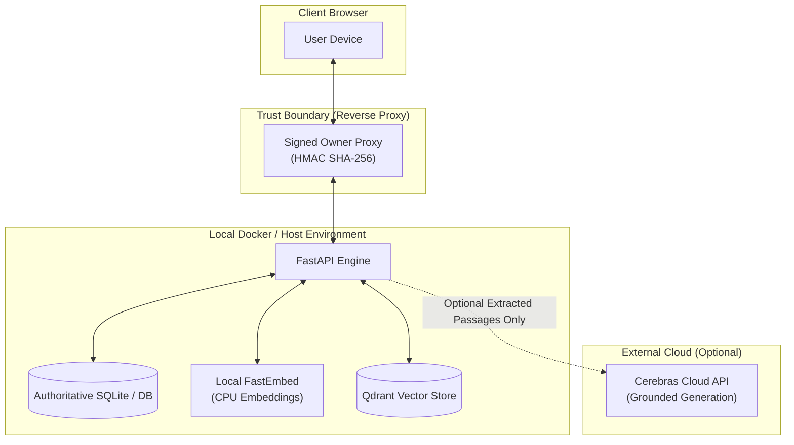

# Product Overview: Personagraph (RAGbot)

Personagraph is a private, local-first document intelligence and conversational assistant designed specifically for asking questions about **people, roles, relationships, and events** mentioned across personal and organizational documents.

---

## 1. Value Proposition

Traditional RAG applications perform generic semantic search across chunked texts, often missing specific named individuals, roles, and inter-personal connections. Personagraph solves this with **person-aware hybrid intelligence**:

- **Entity-First Retrieval**: Automatically detects and indexes named people across uploaded documents.
- **Traceable Citations**: Every answer is strictly grounded in retrieved document passages with expandable, verifiable page/document citations.
- **Local-First Privacy**: Document embeddings, vector indexes, and relational data remain on local infrastructure. Raw document content is never sent to third-party embedding providers.
- **Deterministic & LLM Dual-Mode**: Works out-of-the-box using local grounded extraction (zero API keys required) with optional acceleration via high-throughput LLM backends (such as Cerebras Cloud).

---

## 2. Target Use Cases

| Domain | Use Case | Example Query |
| :--- | :--- | :--- |
| **Executive & HR Intelligence** | Organization mapping, bios, meeting notes | *"Who was leading the infrastructure migration in Q3?"* |
| **Legal & Compliance** | Deposition notes, witness statements, contracts | *"What statements did Dr. Evans make regarding the agreement?"* |
| **Research & Academia** | Historical notes, paper authorship, collaborations | *"Which researchers contributed to the clinical trial protocol?"* |
| **Personal Notes & CRM** | Personal journals, meeting memos, rolodex notes | *"What hobbies and past projects did Maya mention in her profile?"* |

---

## 3. Core Features & Capabilities

### Document Library Management
- **Multi-Format Ingestion**: Supports PDF, DOCX, Markdown (`.md`), and plain text (`.txt`) files up to 10 MB per document.
- **Ordered Lifecycle Storage**: Original files are persisted in isolated upload directories, with metadata and text chunks indexed into an authoritative relational database.
- **Real-Time Index Status**: Visual health badges indicating document states: `ready`, `indexing`, `needs_reindex`, and `lexical-only`.
- **Safe Recoverable Deletion**: Committed database deletions cascade across chunks and people, with durable cleanup queues for filesystem and vector index unlinking.

### Person & Entity Intelligence
- **Heuristic Person Extraction**: Automatically parses personal names, aliases, and honorifics during document ingestion.
- **People in Scope Sidebar**: Dynamic directory of subjects detected within selected document scopes, complete with mention frequency and document counts.
- **Single-Click Person Scoping**: Filter question answering to a specific subject, prioritizing passages containing that individual.

### Hybrid Retrieval & Grounded Generation
- **BM25 Lexical + FastEmbed Dense Retrieval**: Combines exact keyword matching with semantic embeddings (`BAAI/bge-small-en-v1.5`) via Qdrant.
- **Reciprocal Rank Fusion (RRF)**: Merges sparse and dense search rankings deterministically, applying positive boosts for target person mentions.
- **Verifiable In-Text Citations**: Responses feature numbered badges (e.g. `[1]`, `[2]`) linked to source excerpts showing filename, page number, and similarity score.
- **Graceful Degradation**: If vector services or external LLM APIs are unavailable, Personagraph seamlessly falls back to lexical search and deterministic extractive synthesis.

### Conversation History & Multi-Session Management
- **Persistent Chat Sessions**: Multi-turn conversation histories stored in the database with custom topics.
- **Optimistic Browser Caching**: LocalStorage hydration for responsive offline viewing and draft persistence.
- **Owner-Scoped Multi-Tenancy**: Opaque owner derivation via signed frontend reverse-proxy headers, preventing user impersonation.

---

## 4. Privacy & Trust Architecture

1. **No External Embedding Transmission**: Chunk texts are embedded locally using CPU-based FastEmbed models.
2. **Restricted LLM Payload**: When external LLM generation is enabled, only retrieved top-$K$ excerpts and the user question are transmitted. Full document files are never uploaded to the model API.
3. **No Database Secrets**: All credentials and proxy secrets are managed strictly via environment variables (`.env`).
