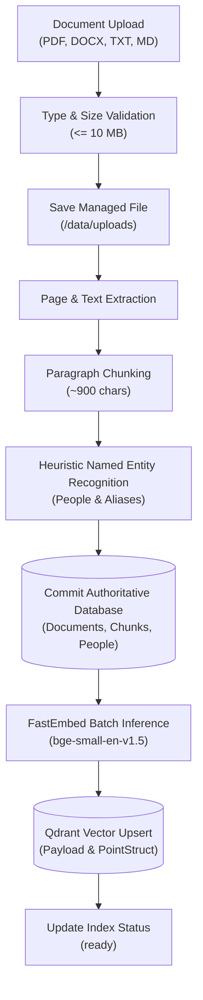
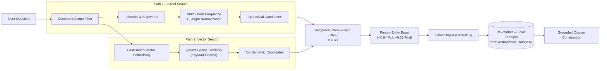

# Hybrid Retrieval Engine

Personagraph implements a dual-path hybrid retrieval engine combining lexical keyword search and dense vector search with entity-aware rank fusion. This architecture delivers high precision on exact entity queries and strong semantic recall on conversational prompts.

---

## 1. Ingestion & Document Processing Pipeline

### Document Extraction
- **PDF**: Processed with `pypdf` page-by-page. Empty/scanned pages trigger an actionable error prompting OCR.
- **DOCX**: Processed with `python-docx`, parsing paragraphs into sequential text units.
- **TXT / Markdown**: Decoded with `utf-8-sig` with whitespace and newline normalization.

### Chunking Strategy
- Paragraphs are split into sequential chunks with a default limit of 900 characters per chunk.
- Long paragraphs exceeding the threshold are split along word boundaries.
- Each chunk preserves its source `ordinal` index, parent `document_id`, `page` number, and associated detected people entities.

### Entity Recognition (NER)
- Employs deterministic regex heuristics targeting capitalized title structures (`Dr.`, `Prof.`, `Mr.`, `Ms.`) and standard two-to-four token capitalized name patterns.
- Applies generic term and role term filtering (excluding common headers like *Company*, *Report*, *Engineer*, *Director*).
- Aggregates person mention counts and normalized names into the `people` relational table.

---

## 2. Dual-Path Retrieval Architecture

### Path 1: Lexical BM25 Scoring
Lexical scoring tokenizes query terms against candidate chunks using term frequency and inverse document frequency (IDF):
$$\text{IDF}(t) = \ln\left(1 + \frac{N - n(t) + 0.5}{n(t) + 0.5}\right)$$

Candidate chunks are scored based on query term matches adjusted for chunk length relative to average document chunk length. Direct mention of the identified subject adds an immediate boost (+4.0 for full name match, +1.0 for first name match).

### Path 2: Dense Vector Search
- **Embedding Model**: `BAAI/bge-small-en-v1.5` (384 dimensions, cosine distance).
- **Execution**: Runs locally via FastEmbed on CPU without external API calls.
- **Scoping**: Qdrant queries apply payload filters to restrict matches strictly to scoped `document_id`s.

---

## 3. Reciprocal Rank Fusion (RRF) & Entity Boosting

Rankings from lexical and vector candidate lists are fused using Reciprocal Rank Fusion:
$$\text{RRF\_Score}(d) = \sum_{m \in \{\text{lexical}, \text{vector}\}} \frac{1}{k + r_m(d)}$$
where $k = 60$ is the smoothing rank constant, and $r_m(d)$ is the 1-based rank of document chunk $d$ in method $m$.

### Person Entity Boost
After reciprocal fusion, scores receive a boost if the chunk content matches detected or explicitly selected subjects:
- **Full Name Match**: $+0.04$
- **First Name Match**: $+0.01$

Top-$K$ fused chunks are normalized to a relative confidence score ($0.0 \dots 1.0$) for display in the UI.

---

## 4. Citation Grounding & Generation Modes

1. **Authoritative Excerpt Guarantee**: Even when retrieved via Qdrant, excerpt text, filenames, and page numbers are **always loaded from SQLite** by `chunk_id`. This prevents stale vector payloads from reaching answers.
2. **Cerebras LLM Mode**: When `CEREBRAS_API_KEY` is set, formatted sources `[1]`, `[2]` are passed to the model with strict developer instructions requiring citation markers for all factual assertions.
3. **Local Grounded Synthesis**: When running without an API key, the system extracts the highest-scoring sentences directly referencing the query terms and entities, generating grounded answers deterministically with corresponding citation references.
