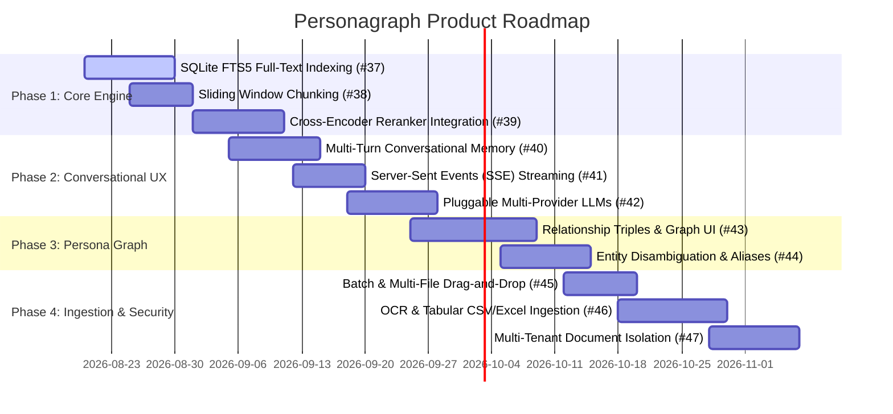

# Product Development Roadmap

This roadmap outlines the planned development phases, enhancements, and architectural upgrades for Personagraph (RAGbot). Each initiative maps to an active tracking issue on GitHub.

---

## Roadmap Overview

---

## Phase 1: Retrieval & Core Engine Upgrade

Focus: Maximizing retrieval precision, eliminating in-memory bottlenecks, and improving chunk coherence.

| Issue | Title | Description |
| :--- | :--- | :--- |
| [#37](https://github.com/avikumart/RAGbot/issues/37) | **SQLite FTS5 Full-Text Indexing** | Replace in-memory tokenization and Python-level BM25 scoring with native SQLite FTS5 virtual tables and C-level BM25 ranking for sub-millisecond retrieval. |
| [#38](https://github.com/avikumart/RAGbot/issues/38) | **Sliding Window Chunking with Overlap** | Implement configurable chunk sizes (e.g. 800 chars) with sliding window overlap (e.g. 150 chars) to prevent context fragmentation across boundaries. |
| [#39](https://github.com/avikumart/RAGbot/issues/39) | **Two-Stage Cross-Encoder Reranking** | Add a lightweight local reranker (`FlashRank` / `bge-reranker-small`) after Reciprocal Rank Fusion (RRF) to rescore candidate passages before citation generation. |

---

## Phase 2: Conversational Intelligence & UX

Focus: Enabling natural follow-up dialogue, instant real-time response rendering, and flexible model hosting.

| Issue | Title | Description |
| :--- | :--- | :--- |
| [#40](https://github.com/avikumart/RAGbot/issues/40) | **Multi-Turn Conversational Memory & Query Rewriting** | Pass active session conversation turns to LLM prompts and implement query reformulation to resolve pronouns (*\"What else did they do?\"*). |
| [#41](https://github.com/avikumart/RAGbot/issues/41) | **Server-Sent Events (SSE) Streaming Generation** | Stream tokens live from the LLM to the React UI as they generate, eliminating blank waiting intervals. |
| [#42](https://github.com/avikumart/RAGbot/issues/42) | **Pluggable Multi-Provider LLM Backends** | Decouple provider integrations to support local Ollama/vLLM, OpenAI, Google Gemini, and Anthropic alongside Cerebras Cloud. |

---

## Phase 3: Entity Intelligence & Persona Graph Visualization

Focus: Extracting rich relational knowledge and visualizing people/organization networks interactively.

| Issue | Title | Description |
| :--- | :--- | :--- |
| [#43](https://github.com/avikumart/RAGbot/issues/43) | **Relationship Triples & Interactive Persona Graph** | Extract `[Subject] -> [Relation] -> [Object]` connections and display an interactive knowledge graph network in the frontend UI. |
| [#44](https://github.com/avikumart/RAGbot/issues/44) | **Entity Disambiguation & Alias Clustering** | Unify name variants (e.g., *\"Dr. Smith\"*, *\"Bob Smith\"*, *\"Bob\"*) into canonical persona entities with consolidated citation tracking. |

---

## Phase 4: Ingestion & Multi-Tenant Privacy

Focus: High-volume document intake, expanded media formats, and robust tenant isolation.

| Issue | Title | Description |
| :--- | :--- | :--- |
| [#45](https://github.com/avikumart/RAGbot/issues/45) | **Batch / Multi-File Drag-and-Drop Ingestion** | Support simultaneous multi-file and folder upload with individual file progress indicators and background processing. |
| [#46](https://github.com/avikumart/RAGbot/issues/46) | **OCR Support & Tabular CSV/XLSX Ingestion** | Add optical character recognition for scanned PDFs, tabular chunking for spreadsheets, and direct web URL scrapers. |
| [#47](https://github.com/avikumart/RAGbot/issues/47) | **Document-Level Multi-Tenancy & Access Control** | Add `owner_id` scoping to the `documents` schema and vector payloads for strict multi-user document isolation. |
