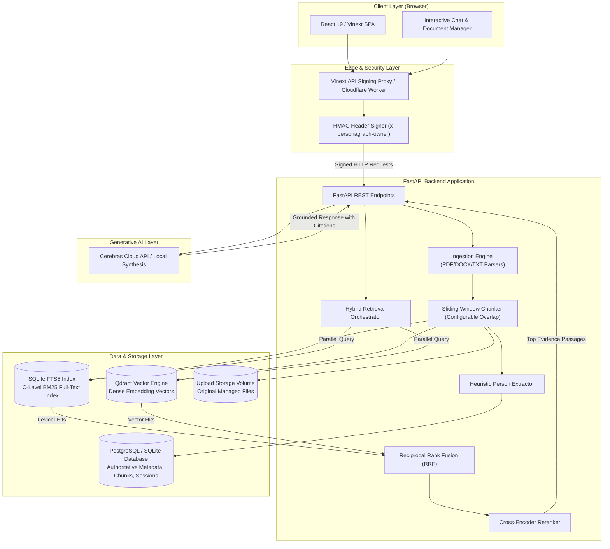
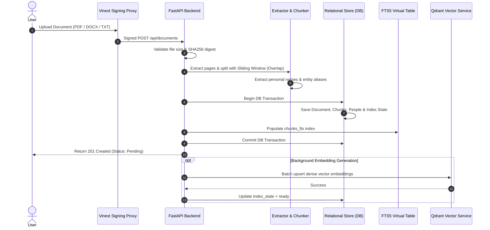
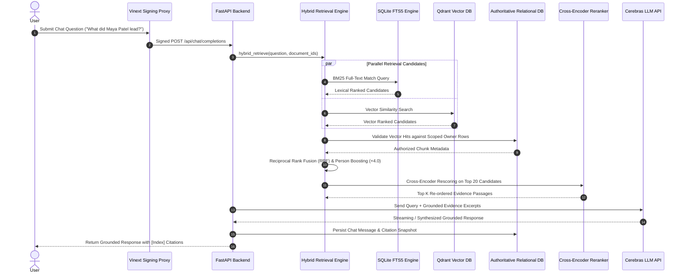
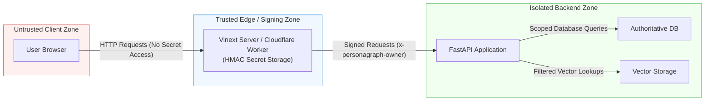

# System Architecture Diagrams

This document contains high-level and detailed architectural diagrams for **Personagraph (RAGbot)**, illustrating runtime topology, component boundaries, document ingestion pipelines, hybrid retrieval orchestration, and security trust zones.

---

## 🏗️ Overall System Architecture

The following diagram depicts the end-to-end component topology, data storage layers, and external integrations of Personagraph:

---

## 📥 Document Ingestion Pipeline

The sequence below details the multi-stage document ingestion workflow from user upload to dual FTS5 and vector indexing:

---

## 🔍 Hybrid Retrieval & Reranking Sequence

The diagram below outlines the multi-stage hybrid search strategy combining BM25 keyword matching, FastEmbed vector search, Reciprocal Rank Fusion (RRF), Person Boosting, and Cross-Encoder rescoring:

---

## 🔒 Trust Boundaries & Data Security

