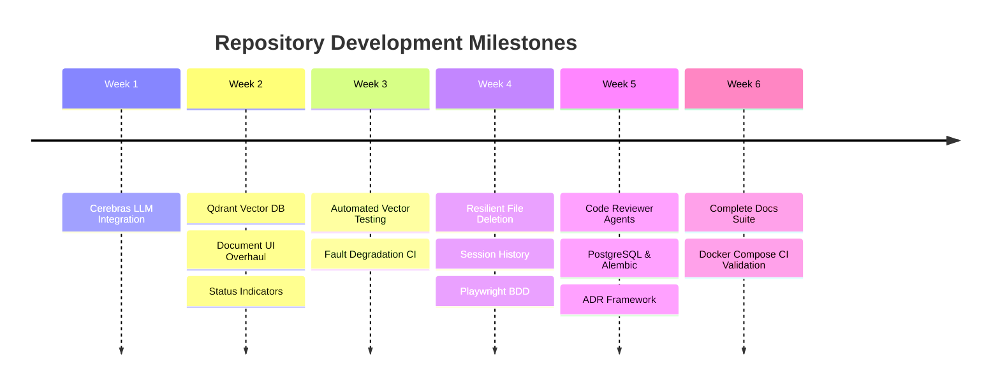

# Weekly Pull Request Timeline & Summary

This document presents a chronological, weekly summary of all merged Pull Requests in the **Personagraph (RAGbot)** repository. It tracks key milestones, core technical features, database migrations, UI enhancements, and test suite improvements.

---

## 📊 Executive Overview

- **Total Merged Pull Requests**: 23
- **Timeframe**: July 19, 2026 – August 19, 2026
- **Core Pillars**:
  1. **RAG & Vector Retrieval**: Qdrant integration, FastEmbed vectors, Reciprocal Rank Fusion, Cerebras LLM.
  2. **Storage & Resiliency**: PostgreSQL migration, Alembic ordered schema, recoverable file deletion.
  3. **User Experience & Sessions**: Durable chat sessions, document indexing status, subjects sidebar.
  4. **Testing & Quality Assurance**: Unit vector tests, Playwright BDD specs, Docker container CI gates.
  5. **Architecture & Governance**: Architectural decision records (ADRs), system documentation, reviewer subagents.

---

## 📅 Chronological Weekly Summaries

### Week 1: July 13 – July 19, 2026
**Theme**: Core LLM Integration & Foundation

| PR # | Title | Branch | Merged Date | Key Deliverables |
|:---:|:---|:---|:---:|:---|
| [#1](https://github.com/avikumart/RAGbot/pull/1) | **cerebras llm api integration** | `feature/cerebras-llm-integration` | 2026-07-19 | Integrated Cerebras LLM API into backend pipeline for high-speed grounded text generation. |

---

### Week 2: July 20 – July 26, 2026
**Theme**: Vector Store Integration & Document UI Overhaul

| PR # | Title | Branch | Merged Date | Key Deliverables |
|:---:|:---|:---|:---:|:---|
| [#4](https://github.com/avikumart/RAGbot/pull/4) | **Added qdrant vector db docker compose service** | `2-add-the-vector-db-and-embedding-for-the-vector-data-storage` | 2026-07-20 | Added Qdrant Vector DB container service and FastEmbed embedding integration. |
| [#11](https://github.com/avikumart/RAGbot/pull/11) | **Document lib overhaul** | `fix/document-chunk-display-UI-fix` | 2026-07-22 | Redesigned frontend document library and chunk display interface. |
| [#13](https://github.com/avikumart/RAGbot/pull/13) | **Document upload ui fix** | `fix/5-Document-upload-check-fix` | 2026-07-26 | Fixed document upload validation, error feedback, and file handling controls. |
| [#14](https://github.com/avikumart/RAGbot/pull/14) | **Implemented accurate document indexing statuses** | `fix/Display-accurate-indexing-status` | 2026-07-26 | Added granular document indexing statuses (`pending`, `indexed`, `failed`) to API and UI. |

---

### Week 3: July 27 – August 2, 2026
**Theme**: Automated Vector Testing & Fault Degradation Coverage

| PR # | Title | Branch | Merged Date | Key Deliverables |
|:---:|:---|:---|:---:|:---|
| [#17](https://github.com/avikumart/RAGbot/pull/17) | **Implemented the vector-test CI coverage** | `fix/run-vector-tests` | 2026-07-31 | Introduced automated unit and integration tests for vector similarity search in CI. |
| [#18](https://github.com/avikumart/RAGbot/pull/18) | **Test degraded indexing status workflow** | `fix/indexing-status-in-doc-list` | 2026-08-02 | Added test suites covering degraded vector store fallback workflows in document listing. |

---

### Week 4: August 3 – August 9, 2026
**Theme**: Resilient Storage, User Sessions & BDD Automation

| PR # | Title | Branch | Merged Date | Key Deliverables |
|:---:|:---|:---|:---:|:---|
| [#19](https://github.com/avikumart/RAGbot/pull/19) | **Implemented schema versioning** | `feature/schema-versionining-` | 2026-08-03 | Implemented SQLite `user_version` schema migration mechanism. |
| [#20](https://github.com/avikumart/RAGbot/pull/20) | **Implemented recoverable document-file deletion** | `fix/stored-file-deleation-failure-resilient` | 2026-08-04 | Built failure-resilient document deletion guaranteeing local/remote store cleanup. |
| [#23](https://github.com/avikumart/RAGbot/pull/23) | **Implemented the refactor while preserving behavior** | `fix/frontend-api-layer-changes` | 2026-08-06 | Refactored frontend API client layer with structured exception handling. |
| [#24](https://github.com/avikumart/RAGbot/pull/24) | **Fixed both PR #20 robustness issues** | `fix/PR-#20-migration-issues` | 2026-08-06 | Fixed edge-case transactions and migration edge states during file deletion. |
| [#26](https://github.com/avikumart/RAGbot/pull/26) | **Implemented durable, user-scoped chat sessions** | `feature/session-history-and-new-session-convo` | 2026-08-07 | Added multi-session chat persistence, session creation, switching, and user isolation. |
| [#28](https://github.com/avikumart/RAGbot/pull/28) | **Reorganized the project root and added documentation** | `fix/code-restrcutre-and-test-suite-fix` | 2026-08-09 | Standardized repository layout into `frontend/` and `backend/` directories. |
| [#29](https://github.com/avikumart/RAGbot/pull/29) | **Implemented Playwright BDD** | `test/bdd-tests-additions` | 2026-08-09 | Configured Playwright end-to-end BDD testing framework and feature scenarios. |

---

### Week 5: August 10 – August 16, 2026
**Theme**: Architectural Governance, PostgreSQL Migration & CI Reliability

| PR # | Title | Branch | Merged Date | Key Deliverables |
|:---:|:---|:---|:---:|:---|
| [#30](https://github.com/avikumart/RAGbot/pull/30) | **codex sub agents to review code** | `agent/reviwer-agents-and-skills-md` | 2026-08-11 | Defined agent reviewer skills and configuration specs for code reviews. |
| [#31](https://github.com/avikumart/RAGbot/pull/31) | **Ensure Cerebras is queried for each grounded chat** | `agent/fix-27-cerebras-per-query` | 2026-08-11 | Guaranteed per-query LLM execution with strict grounding payload formatting. |
| [#32](https://github.com/avikumart/RAGbot/pull/32) | **Add no-evidence chatbot BDD coverage** | `agent/add-chatbot-bdd-e2e-tests` | 2026-08-12 | Expanded BDD suite to test graceful chatbot responses when vector search returns 0 results. |
| [#33](https://github.com/avikumart/RAGbot/pull/33) | **Improve subjects sidebar descriptions** | `agent/improve-subjects-sidebar` | 2026-08-13 | Enhanced subjects sidebar UI component with descriptive topic labels. |
| [#34](https://github.com/avikumart/RAGbot/pull/34) | **Make CI checks comprehensive and reliable** | `agent/fix-25-ci-checks` | 2026-08-14 | Consolidated local check scripts and fixed CI execution flakiness. |
| [#35](https://github.com/avikumart/RAGbot/pull/35) | **Document system architecture and ADR workflow** | `agent/issue-21-architecture-adrs` | 2026-08-15 | Standardized Architecture Decision Record (ADR) process and system architecture docs. |
| [#36](https://github.com/avikumart/RAGbot/pull/36) | **Migrate backend storage to PostgreSQL with Alembic** | `agent/issue-22-postgresql-alembic` | 2026-08-16 | Integrated PostgreSQL database backend and Alembic schema migration pipeline. |

---

### Week 6: August 17 – August 23, 2026 (Current)
**Theme**: System Documentation Overhaul & Containerized CI Gates

| PR # | Title | Branch | Merged Date | Key Deliverables |
|:---:|:---|:---|:---:|:---|
| [#48](https://github.com/avikumart/RAGbot/pull/48) | **docs: comprehensive product, architecture, api, and roadmap documentation** | `docs/product-documentation` | 2026-08-19 | Overhauled technical documentation across product, hybrid search engine, REST APIs, and roadmap. |
| [#49](https://github.com/avikumart/RAGbot/pull/49) | **ci: add docker compose and container build validation to pr checks** | `ci/enhanced-pr-checks` | 2026-08-19 | Added Docker Compose validation and container build test gates to GitHub Actions. |

---

## 📈 Cumulative Progression

